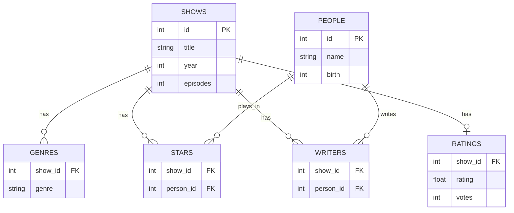

# ERD

```mermaid
erDiagram
    SHOWS {
        int id PK
        string title
        int year
        int episodes
    }
    PEOPLE {
        int id PK
        string name
        int birth
    }
    GENRES {
        int show_id FK
        string genre
    }
    STARS {
        int show_id FK
        int person_id FK
    }
    WRITERS {
        int show_id FK
        int person_id FK
    }
    RATINGS {
        int show_id FK
        float rating
        int votes
    }

    SHOWS ||--o{ GENRES : has
    SHOWS ||--o{ STARS : has
    PEOPLE ||--o{ STARS : plays_in
    SHOWS ||--o{ WRITERS : has
    PEOPLE ||--o{ WRITERS : writes
    SHOWS ||--o| RATINGS : has
```
